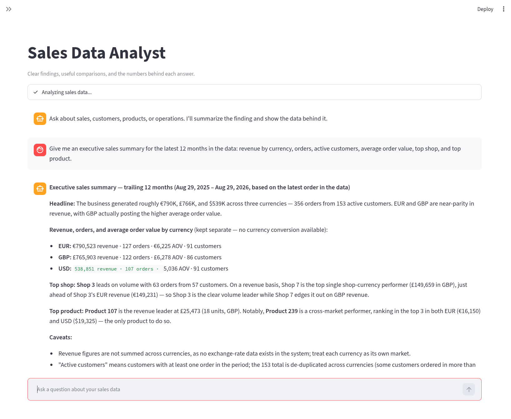

# Sales Data Analyst (DB Agent)

Sales Data Analyst is a Streamlit chat application for exploring PostgreSQL
sales data in plain language. It uses an OpenAI-compatible model to plan
strictly read-only SQL queries across one or more databases, validates every
query, combines federated results in memory, and presents business findings
with KPI cards, charts, and downloadable tables.

> 💡 **Extensibility:** Select a Markdown domain profile and point the agent at a
> different database to create an analyst for another purpose without editing
> Python prompt strings.

The setup instructions below are for the developer or operator running the
application. Business users only need the Streamlit URL produced at startup.



## Quick start

This recommended path runs PostgreSQL locally with Docker and connects to an
existing OpenAI-compatible or vLLM model endpoint. Run every command from the
repository root, where `manage.py` and `gui.py` are located.

### 1. Check the prerequisites

- Docker with Docker Compose
- Python 3.12 or newer
- [uv](https://github.com/astral-sh/uv)
- A chat-completions model endpoint with function/tool calling enabled

### 2. Configure the environment

```bash
cp .env.example .env
```

Open `.env` and set the PostgreSQL container values, the matching database-agent
connection, the model name, and the model endpoint. A complete model endpoint
takes precedence over `LLM_HOST` and `LLM_PORT`:

```env
POSTGRES_DB=dbagent
POSTGRES_USER=postgres
POSTGRES_PASSWORD=choose-a-password
POSTGRES_HOST=localhost
POSTGRES_PORT=5656

DB_AGENT_DATABASE_HOST=localhost
DB_AGENT_DATABASE_PORT=5656
DB_AGENT_DATABASE_NAME=dbagent
DB_AGENT_DATABASE_USER=dbagent_reader
DB_AGENT_DATABASE_PASSWORD=choose-a-reader-password
DB_AGENT_PROFILE=sales
DB_AGENT_ENFORCE_READONLY_ROLE=true

LLM_MODEL_NAME=your-served-model-name
LLM_API_MODE=chat
LLM_API_BASE_URL=http://192.168.1.50:8000/v1
LLM_API_KEY=EMPTY
```

The database-agent credentials intentionally differ from the owner credentials.
The reader role is created after migrations in the next step. Use the real API
key instead of `EMPTY` when the model endpoint requires one. See
[`.env.example`](.env.example) for every available setting.

### 3. Install dependencies and start PostgreSQL

```bash
uv sync
docker compose up -d db
docker compose ps
```

Wait until `dbagent-db` reports `healthy`.

### 4. Initialize and populate the database

```bash
uv run manage.py migrate
uv run manage.py load_csv_data --path data
```

The bundled CSV files provide the sample sales data used by the showcase
questions. The loader is idempotent, so running it again will not duplicate
existing records.

Create a dedicated reader role. Choose the same reader password configured in
`.env`; do not reuse the PostgreSQL owner account for the agent:

```bash
docker compose exec db psql -U postgres -d dbagent
```

Run these statements in `psql`, replacing the example password:

```sql
CREATE ROLE dbagent_reader LOGIN PASSWORD 'choose-a-reader-password';
REVOKE TEMPORARY ON DATABASE dbagent FROM PUBLIC;
GRANT CONNECT ON DATABASE dbagent TO dbagent_reader;
GRANT USAGE ON SCHEMA public TO dbagent_reader;
GRANT SELECT ON ALL TABLES IN SCHEMA public TO dbagent_reader;
ALTER DEFAULT PRIVILEGES IN SCHEMA public
    GRANT SELECT ON TABLES TO dbagent_reader;
```

Exit with `\q`. The application never creates roles or changes grants itself.

### 5. Verify the model and agent

```bash
uv run manage.py llm_ask "Reply with: model ready"
uv run manage.py db_ask "How many active customers are in the system?"
```

The first command checks the configured model endpoint. The second checks the
complete schema-inspection, tool-calling, SQL-validation, and database flow.

### 6. Start the Streamlit chat

```bash
uv run streamlit run gui.py
```

Streamlit prints addresses similar to:

```text
Local URL: http://localhost:8501
Network URL: http://192.168.1.20:8501
```

Open the local URL on the same computer. Share the network URL with business
users on the same reachable network, subject to the host firewall and network
policy. Keep the terminal running while the app is in use and press `Ctrl+C` to
stop it.

Restart Streamlit after changing `.env`. **Clear chat** starts a new
conversation and rebuilds the agent runtime, but it does not reload environment
variables already loaded by the running Python process.

## Readiness checklist

Before sharing the application, confirm that:

- `docker compose ps` reports PostgreSQL as healthy.
- `uv run manage.py migrate` completes without pending migration errors.
- `uv run manage.py load_csv_data --path data` completes successfully.
- `uv run manage.py llm_ask "Reply with: model ready"` returns a response.
- The basic `db_ask` command returns a customer count.
- `uv run streamlit run gui.py` prints a reachable URL.

## Model endpoint options

### Remote model endpoint

For a model running on another machine, use either a complete URL:

```env
LLM_API_BASE_URL=http://192.168.1.50:8000/v1
```

or a host and port:

```env
LLM_HOST=192.168.1.50
LLM_PORT=8000
```

`LLM_API_BASE_URL` takes precedence when both forms are set. Verify a vLLM
endpoint directly when troubleshooting connectivity:

```bash
curl http://192.168.1.50:8000/health
curl http://192.168.1.50:8000/v1/models
```

With a remote endpoint, start only the local database; there is no need to run
the Compose `llm` service.

### Local vLLM endpoint

Running vLLM locally requires an NVIDIA GPU supported by vLLM, the NVIDIA
Container Toolkit, enough GPU memory for the selected model, and an absolute
host path to the model files. Configure the model-related values in `.env`, then
start the service:

```env
LLM_HOST_MODEL_PATH=/absolute/path/to/your/model
LLM_CONTAINER_MODEL_PATH=/models/llm
LLM_MODEL_NAME=your-served-model-name
LLM_HOST=127.0.0.1
LLM_PORT=8000
LLM_GPU_DEVICE_ID=0
```

```bash
docker compose up -d llm
docker compose ps
docker compose logs -f llm
```

The database agent requires automatic tool choice and a parser compatible with
the selected model. A vLLM launch normally needs:

```text
--enable-auto-tool-choice
--tool-call-parser <parser-compatible-with-your-model>
```

Consult the vLLM documentation for the parser supported by the exact model and
vLLM version. The current `docker-compose.yml` does not append these two flags;
setting `LLM_ENABLE_AUTO_TOOL_CHOICE` or `LLM_TOOL_CALL_PARSER` in `.env` alone
does not change the Compose command. Until the Compose service is updated for
the selected model, treat it as a base vLLM launcher rather than a turnkey
tool-calling configuration.

## Using Sales Data Analyst

The chat answers in business language and shows the data behind each answer.
SQL, model metadata, and execution details remain collapsed under **How this
was calculated**.

Follow-up questions reuse the current conversation. For example, after a
monthly comparison, ask “Which shop drove the change?” or “Now show only GBP.”
Conversation context is held in memory for the current Streamlit session only;
old conversations are not saved.

The default showcase questions are maintained in
[`customer_service/llm/config/sales/examples.md`](customer_service/llm/config/sales/examples.md)
and appear automatically in the sidebar.

Monetary analyses keep currencies separate unless conversion data is available.

If an analysis fails, the chat shows a short error ID and a collapsed diagnostic.
The Streamlit terminal prints a Rich traceback with the same ID so an operator
can correlate the report. Tracebacks omit frame-local values. Keep terminal
logs access-controlled because errors returned by external services may include
their own details.

## Command-line usage

Use `llm_ask` for a plain model prompt:

```bash
uv run manage.py llm_ask "List three shop names."
uv run manage.py llm_ask --system "You are a data analyst assistant." "Summarize the top five customers."
```

Use `db_ask` for a grounded database question:

```bash
uv run manage.py db_ask "How many active customers are in the system?"
uv run manage.py db_ask "Top five products by total purchase amount this month."
```

`db_ask` refreshes the allowed PostgreSQL schema, asks the model to call the
read-only SQL tool, validates the query, applies row and timeout limits, and
returns the answer with an execution trace.

## Configuration reference

Important database-agent settings include:

- `DB_AGENT_DATABASE_URL`
- `DB_AGENT_DATABASE_HOST`, `DB_AGENT_DATABASE_PORT`, `DB_AGENT_DATABASE_NAME`
- `DB_AGENT_DATABASE_USER`, `DB_AGENT_DATABASE_PASSWORD`
- `DATABASES_AVAILABLE` — optional JSON list of databases on the shared server;
  maximum 25
- `DB_AGENT_ALLOWED_SCHEMAS`, `DB_AGENT_ALLOWED_TABLES`
- `DB_AGENT_MAX_ROWS`, `DB_AGENT_MAX_RESULT_CHARS`
- `DB_AGENT_STATEMENT_TIMEOUT_MS`
- `DB_AGENT_MAX_TOOL_CALLS` — maximum SQL executions per question
- `DB_AGENT_QUERY_RETRIES`
- `DB_AGENT_MODEL_MAX_TOKENS` — output budget per model turn; default `4096`
- `DB_AGENT_ENABLE_THINKING` — Qwen/vLLM thinking mode; default `true`
- `DB_AGENT_PROFILE` — Markdown domain profile; default `sales`
- `DB_AGENT_ENFORCE_READONLY_ROLE` — reject credentials with mutation or
  object-creation privileges; default `true`
- `DB_AGENT_SCHEMA_CACHE_TTL_SECONDS` — catalog cache lifetime; default `300`
- `DB_AGENT_MAX_DATABASE_CONCURRENCY` — parallel source reads; default `4`
- `DB_AGENT_MAX_INTERMEDIATE_ROWS` — exact-federation limit per source query;
  default `10000`
- `DB_AGENT_MAX_FEDERATED_BYTES` — total in-memory source-result limit; default
  `50000000`

Important model-client settings include:

- `LLM_MODEL_NAME`
- `LLM_API_MODE` — must be `chat` for tool calling
- `LLM_API_BASE_URL`, or `LLM_HOST` and `LLM_PORT`
- `LLM_API_KEY`
- `LLM_REQUEST_TIMEOUT_SECONDS`

If a response reaches its output limit before returning a tool call, raise
`DB_AGENT_MODEL_MAX_TOKENS` to `8192`. For lower latency and more direct tool
calls, set `DB_AGENT_ENABLE_THINKING=false`. Restart Streamlit after changing
either value.

## Domain profiles

Each named profile lives under `customer_service/llm/config/<profile>/` and
contains four Markdown files and one structured topology file:

- `profile.md` — application name, icon, caption, welcome message, chat copy,
  analysis status, and data-source label
- `agent.md` — domain persona, terminology, analytical priorities, and answer style
- `examples.md` — sidebar categories and example questions
- `presentation.md` — column-name hints used to select KPI cards and charts
- `sources.toml` — database descriptions, per-source schema/table allowlists,
  and declared cross-database relationships

Create a profile by copying the default and editing the Markdown:

```bash
cp -R customer_service/llm/config/sales customer_service/llm/config/animals
```

Then select it in `.env` and configure the corresponding database connection:

```env
DB_AGENT_PROFILE=animals
```

For a single source, `DB_AGENT_ALLOWED_SCHEMAS` and
`DB_AGENT_ALLOWED_TABLES` remain the runtime allowlists. For multiple sources,
define each allowlist in `sources.toml` as shown below.

Profile names may contain lowercase letters, numbers, hyphens, and underscores.
All required headings and bullet lists are validated at startup. A malformed or
missing profile produces an actionable configuration error instead of silently
falling back to sales content.

The profile controls domain language, presentation hints, and source topology,
but it cannot replace code-owned read-only validation, evidence-grounding rules,
SQL limits, or tool contracts. Changing databases may also require separate
models, migrations, or data-loading code; the bundled Django models and CSV
loader remain sales-specific. Restart Streamlit after editing or changing a
profile.

## Multiple databases

PostgreSQL connections target exactly one database. Multi-database mode therefore
opens separate read-only connections using the shared host, port, username, and
password. Enable it with a JSON list:

```env
DATABASES_AVAILABLE=["commerce","support"]
DB_AGENT_DATABASE_HOST=db.internal
DB_AGENT_DATABASE_PORT=5432
DB_AGENT_DATABASE_USER=analytics_reader
DB_AGENT_DATABASE_PASSWORD=choose-a-reader-password
```

The names must match `[[databases]]` entries in the active profile's
`sources.toml` exactly. If the profile declares more than one source,
`DATABASES_AVAILABLE` is required; the agent will not silently fall back to a
single database:

```toml
[[databases]]
name = "commerce"
description = "Orders, customers, products, and payments."
allowed_schemas = ["public"]
allowed_tables = ["customers", "orders", "order_items", "products"]

[[databases]]
name = "support"
description = "Customer support calls and outcomes."
allowed_schemas = ["crm"]
allowed_tables = ["contacts", "calls"]

[[relationships]]
name = "customer_identity"
left = "commerce.public.customers.id"
right = "support.crm.contacts.customer_id"
cardinality = "one-to-many"
description = "Connects commerce customers to their support history."
```

For each question, the model first selects relevant sources from a compact
catalog, requests detailed schemas, and submits validated source queries. Source
results are copied into a locked-down, in-memory DuckDB instance for an exact
final `SELECT`; DuckDB cannot access files, networks, extensions, or persistent
storage. Source aggregation should be pushed into PostgreSQL. If an intermediate
result reaches its row or memory limit, exact combination is refused rather than
silently approximated.

If one database is unavailable, healthy sources may still produce a partial
answer. The chat names the unavailable database and marks the answer incomplete.
Global totals are only complete when every applicable source succeeds.

## Read-only security

Read-only behavior is enforced in layers:

- the configured role must be non-privileged and `SELECT`-only;
- startup/catalog inspection fails closed when the role can write, create
  objects, use sequences, bypass row security, or create temporary objects;
- every PostgreSQL operation runs in an engine-enforced read-only transaction;
- every connection is rolled back and closed without a commit;
- parser-backed validation permits one read-only query and validates every table
  against the selected source allowlist;
- database names come only from `DATABASES_AVAILABLE`; the model cannot provide a
  connection string.

Apply the reader grants separately in every configured database. The PostgreSQL
role itself is cluster-wide, but database, schema, and table grants are not.

For legacy development environments only, setting
`DB_AGENT_ENFORCE_READONLY_ROLE=false` skips the privilege audit. It does **not**
disable SQL validation, allowlists, read-only transactions, rollback behavior,
or timeouts. Do not use this escape hatch for sensitive production data.

The Django migration, sample-data loader, and reset commands are separate
operator utilities. The agent runtime and both question interfaces never call
them.

## Architecture and conversation behavior

The agent is implemented as a LangGraph workflow. It loads a cached catalog,
lets the model inspect only the relevant detailed schemas, validates each
source query, and produces a business-facing answer. In multi-database mode,
independent PostgreSQL reads may run concurrently before an exact in-memory
combination step. An in-memory checkpointer provides session-scoped follow-ups.

The Streamlit chat reuses one thread ID for follow-ups. The `db_ask` command is
single-turn. Programmatic callers can use:

```python
agent.ask(question, thread_id="session-id")
agent.ask(question, thread_id="session-id", force_query=True)
```

`force_query=True` requires a fresh database read when retrying an answer.

## Tests

The offline suite does not require PostgreSQL or the model server:

```bash
uv run manage.py test
```

Tests live in the root `tests/` package. The suite covers the GUI and real
LangGraph flow with mocked database/model boundaries, along with URL routing,
profile topology validation, read-only transactions, privilege rejection,
SQL-parser guardrails, partial availability, and exact in-memory federation.

## Sample data management

The loader reads the CSV files under `data/` and uses Rich output with progress
bars. Loading without `--truncate` is idempotent:

```bash
uv run manage.py load_csv_data --path data
```

Use `--truncate` only when you intentionally want a clean reload:

```bash
uv run manage.py load_csv_data --path data --truncate
```

Expected files:

- `product_categories.csv`
- `suppliers.csv`
- `shops.csv`
- `customers.csv`
- `customer_addresses.csv`
- `products.csv`
- `purchases.csv`
- `purchase_items.csv`
- `payments.csv`
- `shipments.csv`

## Resetting and stopping services

Clear application data and reset PostgreSQL counters:

```bash
uv run manage.py clear_database --yes
```

Add `--app-only` to truncate only `customer_service` tables. This operation is
destructive and is intended for local or experimental data.

Stop the Compose services without removing the database volume:

```bash
docker compose down
```

Remove the PostgreSQL volume as well:

```bash
docker compose down -v
```

The final command permanently deletes the Compose-managed database volume.
